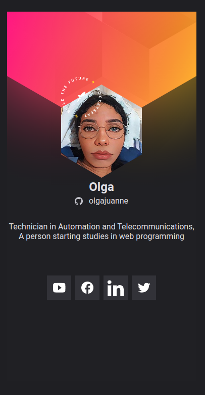

# NLW - Heat

<h2 align="center">
  Crachá Virtual DoWhile
</h2>

Projeto construído durante o evento Next Level Week da Rocketseat.

[🔗 Clique aqui para acessar](https://olgajuanne.github.io/nlw_heat/)

## 🚀 Tecnologias

Esse projeto foi desenvolvido com as seguintes tecnologias:

- HTML
- CSS
- JavaScript
- <a href="https://code.visualstudio.com/"> Visual Studio Code </a>
- <a href="https://www.figma.com/"> Figma </a>

## 💻 Projeto

O Crachá virtual DoWhile é uma aplicação estática com o objetivo de exibir as informações do usuário, obitidas através do GitHub API e inserido em um layout com o tema do evento DoWhile 2021

## :memo: Licença

Esse projeto está sob a licença MIT.

---

>A NLW é um evento de conteúdos gratuitos voltados para programação, promovido pela @Rocketseat.

